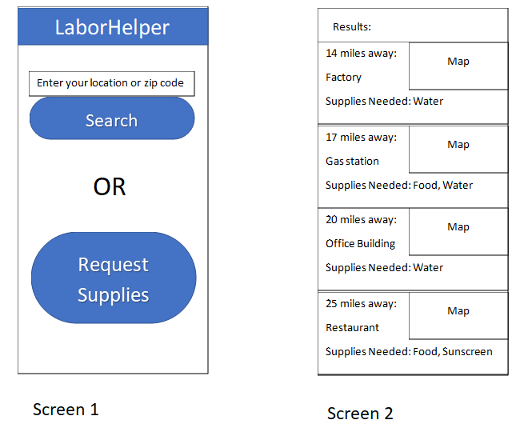
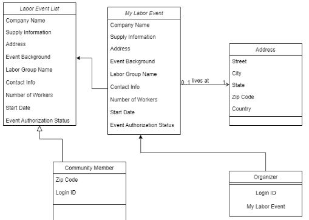

# Introduction

LaborHelper is an application that allows users to find strikes and
labor actions in their area as well as details about what, if anything,
the workers need in terms of supplies or community action. It makes it
easy for community members to support workers in their area.

# Storyboard



# Functional requirements

## 1.0

As a community member I want to see labor actions near me so that I can
provide support to the workers

### 1.1

**Given** a feed of labor action data

**When** I provide a zipcode or other location info

**Then** I should receive a list of labor actions within 25 miles of the
provided location

### 1.2

**Given** a set of labor action results

**When** I select one of the results

**Then** detailed information about the location and needed supplies
should be displayed

### 1.3

**Given** a feed of labor action data

**When** I select request supplies

**Then** I should be able to enter to request supplies needed

## 2.0

As a labor organizer I want to be able to report labor actions and
associated information so that I can get supplies my group needs

### 2.1

**Given** the app is available

**When** I provide credentials to log in

**Then** I should be authenticated

### 2.2

**Given** the app is available

**When** I provide credentials to sign up

**Then** I should be authenticated

### 2.3

**Given** I am authenticated

**When** I choose to report a labor action

**Then** a form should appear to allow me to enter details about that
action

# Class Diagram



# JSON Schema

```
{
    "$schema": "http://json-schema.org/draft-06/schema#",
    "$ref": "#/definitions/LaborAction",
    "definitions": {
        "LaborAction": {
            "type": "object",
            "additionalProperties": false,
            "properties": {
                "id": {
                    "type": "string"
                },
                "groupName": {
                    "type": "string"
                },
                "companyName": {
                    "type": "string"
                },
                "location": {
                    "type": "string"
                },
                "groupContact": {
                    "type": "string"
                },
                "contactInformation": {
                    "type": "string"
                },
                "startDate": {
                    "type": "string"
                },
                "authorized": {
                    "type": "string"
                },
                "numberOfWorkers": {
                    "type": "string",
                    "format": "integer"
                },
                "suppliesNeeded": {
                    "type": "array",
                    "items": {}
                }
            },
            "required": [
                "authorized",
                "companyName",
                "contactInformation",
                "groupContact",
                "groupName",
                "id",
                "location",
                "numberOfWorkers",
                "startDate",
                "suppliesNeeded"
            ],
            "title": "LaborAction"
        }
    }
}
```

# Scrum Roles

**Chris Brown**: Product Owner and Developer  
**Tahj Marshall**: Persistence Specialist       
**Jacob Farrish**: UI Developer  
**TJ Dailey**: UI Developer
**Brandon Nguyen**: UI Developer

# Weekly Meetings

Meetings will be on Teams, day and time is currently to be determined.
